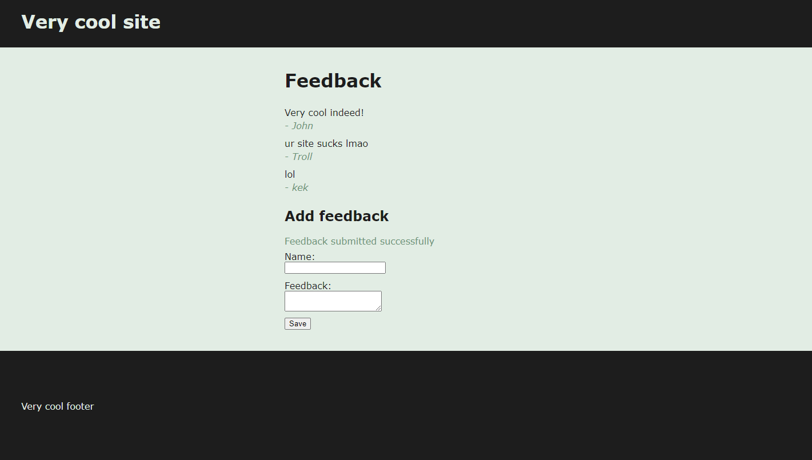
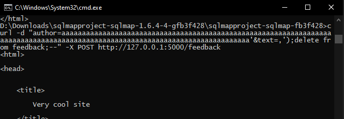
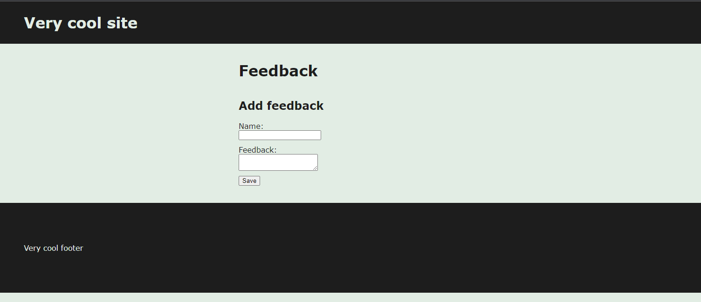
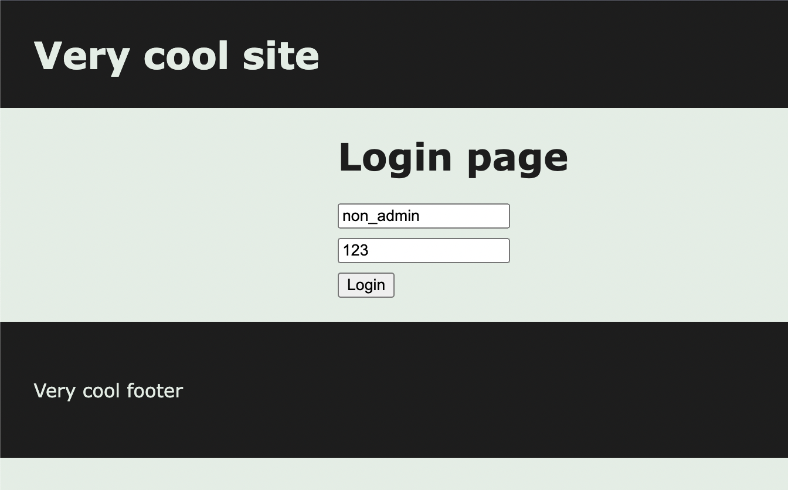
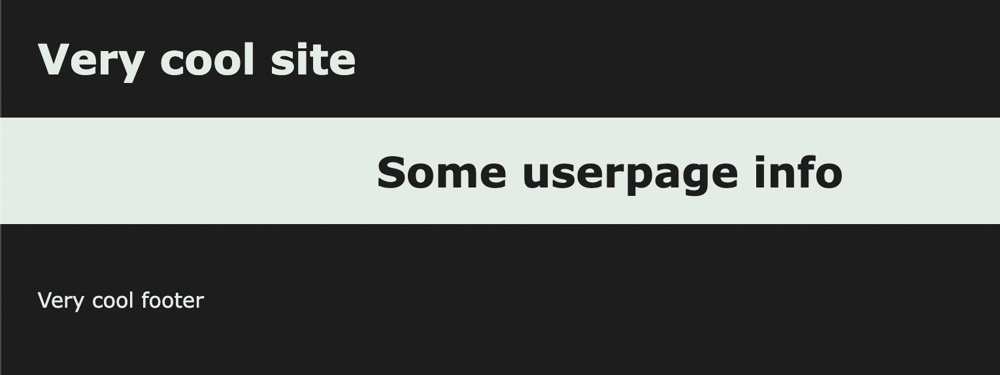
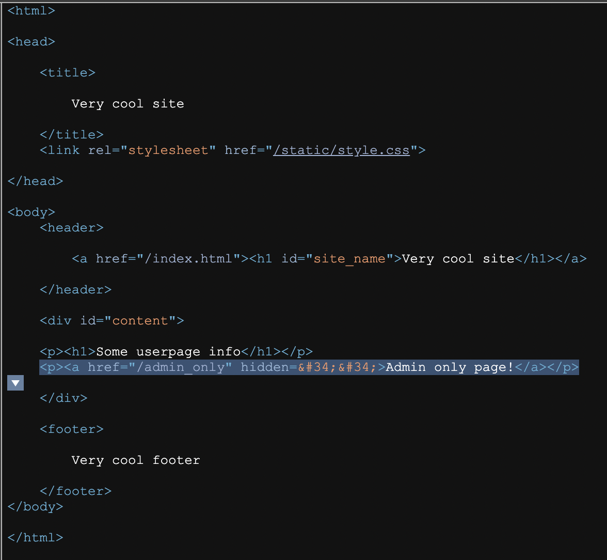
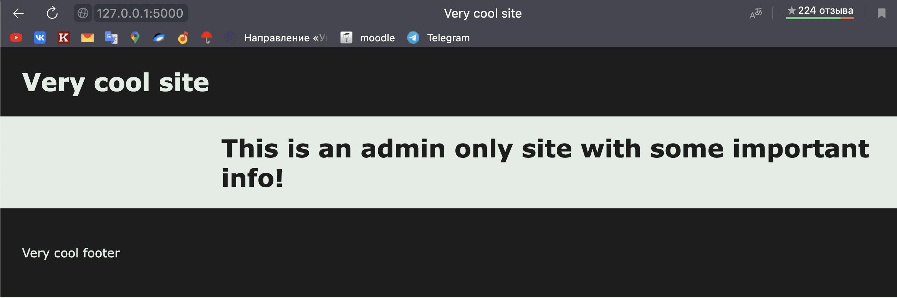

# NCS lab 4
Intentionally vulnerable application (home assignment) for [S22] Network and Cyber Security course at Innopolis University.

The application works on Flask framework and contains these intended vulnerabilities:
* SQL Injection
 
## Authors
The assignment was done by Kirill Ivanov, Ilya Kolomin.

## Launch instructions

### On first startup
* Install flask (if not already): https://flask.palletsprojects.com/en/2.1.x/installation/

* When launching the application for the first time, run `python init_db.py` to initialize the DB using schema

### Start with existing DB
To start the program use this:
```bash
export FLASK_APP=main
flask run
```

## Vulnerabilities
Repository with fixed vulnerabilities can be found [here](https://github.com/bragov4ik/ncs_lab_4/tree/fixed_version)
### SQL Injection
#### Description
This vulnerability allows malicious users to execute unintended queries on the server database (or existing queries with unexpected parameters). It allows to perform some dangerous actions on the database, which include deletion of the records, stealing of the personal data, and etc.

#### Technical description
Currently user input is sanitized naively (by replacing single quote with two single quotes: `'` -> `''`). However, after the sanitizing the input is trimmed to not exceed a certain threshold, which may revert this action. Let's look at the code snippet that manages the SQL query:
```python
author = sanitize(author)
text = sanitize(text)
author = author[:128]
text = text[:512]
q = "INSERT INTO feedback (author, text) VALUES ('{}', '{}');".format(
    author, text
)
conn.cursor().executescript(q)
```
Here, if `author` would be equal to 127 `a` characters and one `'`, sanitize would transform it into 129 character-long string and after that remove the last appended quote. This will turn the query into
```python
"INSERT INTO feedback (author, text) VALUES ('aa...aa'', '{}');"
```
which will allow to write unescaped data into the second field. For example, we could send
```python
text=",');delete from feedback;--"
```
which will result in 
```python
text = sanitize(text)
text == ",'');delete from feedback;--" # True
"INSERT INTO feedback (author, text) VALUES ('aa...aa'', ','');delete from feedback;--');"
```
and this is a valid SQL query that gets executed and results in `feedback` table being purged.
##### Note
We can't simply type the values in the input fields since `maxlength` attribute does not allow us to do so. However, we can easily remove it by opening the page source code and editing it. 
#### Exploitation process
Using tool `curl` we can exploit the vulnerability:
```bash
curl -d "author=aaaaaaaaaaaaaaaaaaaaaaaaaaaaaaaaaaaaaaaaaaaaaaaaaaaaaaaaaaaaaaaaaaaaaaaaaaaaaaaaaaaaaaaaaaaaaaaaaaaaaaaaaaaaaaaaaaaaaaaaaaaaaaa'&text=,');delete from feedback;--" -X POST http://127.0.0.1:5000/feedback
```
Assuming the application is running at http://127.0.0.1:5000/
#### Screenshots during exploitation

Before the attack:



The attack:



Consequences:


As we can see, previous reviews were deleted

#### Fixing recommendations
The following fixes should help with the problem:
1. It's better to use sqlite3's feature called "DB-API's parameter substitution" that is [recommended by authors of the library](https://docs.python.org/3/library/sqlite3.html#sqlite3-placeholders)
2. Use more robust escaping, for example [suggested by the flask's documentation](https://flask.palletsprojects.com/en/2.1.x/quickstart/#html-escaping) `markupsafe.escape`.
3. Trim the strings before manipulations. It helps to avoid the situations similar to aforementioned.
4. Use `execute` instead of `executescript` which ensures that there is only query supplied.
```python
author = author[:128]
text = text[:512]
author = escape(author)
text = escape(text)
conn.cursor().execute(
    "INSERT INTO feedback (author, text) VALUES (?, ?);",
    (author, text)
)
```
#### [Fixed version link](https://github.com/bragov4ik/ncs_lab_4/blob/fixed_version/main.py#L16)

### Broken Access Control

#### Description

In this vulnerability the access control mechanism is not properly implemented which may result in unauthenticated access to the server's resources.  

#### Technical description

There is a login page `/login` which in case of successful logging in redirects to the users page `/user_page` and stores auth token in cookies.

The server checks if the logged user has the admin rights. There is a link to the special admin's page, which is hidden for non-admin users.
```html
<p><h1>Some userpage info</h1></p>
<p><a href="/admin_only" hidden="">Admin only page!</a></p>
```

However, this is the only check and defence against unauthorized access to this page. 

```python
@app.route("/admin_only", methods=['GET'])
def admin_only():
    return prepare_response(render_template("admin_only.html"))
```
_No admin rights check_

So that the attacker could get access to this page's by only requesting this page's reference, which could be easily obtained from the source code of the page.


_Non-admin user logging in_


_Userpage without reference to the admin's site_


_Hidden link in page's code_


_Unauthorized access to admin's page_

#### Fixing recommendations

1. Add access control check on the admins site
```python
@app.route("/admin_only", methods=['GET'])
def admin_only():
    # Broken access control error
    # Right way:
    token = request.cookies.get('auth')
    if get_is_admin(token):
        return prepare_response(render_template("admin_only.html"))
    return prepare_response("You are not admin!")
```

2. Do not **hide** html elements that you don't want to show. Erase them instead. 

